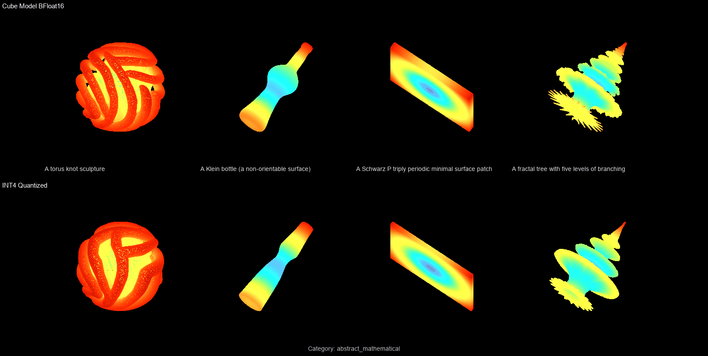

# 🚀 First INT4 Quantized Efficient-Cube3D - Run on Half the VRAM
[](https://huggingface.co/TrNi/efficient-cube3d)         [](https://drive.google.com/file/d/1-mWdiDHJIozQnKC-bP9TmaWR0fQLRo2X/view?usp=sharing)     -blueviolet)      -brightgreen)        -blue)       -yellowgreen)

Presenting the **first INT4 quantized efficient version** of [Cube3D v0.5](https://huggingface.co/Roblox/cube3d-v0.5), a text-to-3D mesh generative model.
Quantized via **RTN W4A16** (group_size=128) using [torchao](https://github.com/pytorch/ao), it cuts the model size from **7.2GB → 1.3GB (82%↓)** 
and peak VRAM from **25.4 GB → 11.3 GB (55%↓)** while maintaining the same inference speed and comparable shape fidelity - 
enabling 3D shape generation on much smaller, more accessible GPUs.

| | BF16 + Engine | BF16 + EngineFast | **INT4 + EngineFast** |
|---|:-:|:-:|:-:|
| 💾 Model size | 7.17 GB | 7.17 GB | **1.26 GB (82%↓)** |
| 🎮 Peak VRAM | 21.7 GB | 25.4 GB | **11.3 GB (55%↓)** ✨ |
| 📦 Setup time | 19.4 s | 206.9 s | **6.9 s (97%↓)** |
| ⏱️ Latency | 90.9 s | 15.0 s | **14.2 s** |

<mark>💡 The 82% size reduction and 55% VRAM reduction means this model now fits on a single 15 GB GPU (e.g. NVIDIA L4, A10, A2 etc.), bringing high-quality text-to-3D generation to individual researchers and end-user hardware.
</mark>

### Original BF16 vs Quantized INT4 Comparisons:
##### A. Easy Categories (3)

##### B. Medium Categories (7)

##### C. Complex Categories (5)



# Cube3D v0.5 - RTN W4A16 INT4 (torchao)

Post-training quantized version of [Roblox/cube3d-v0.5](https://huggingface.co/Roblox/cube3d-v0.5), a text-to-3D mesh generative model.  
Quantization method: **RTN W4A16**, group_size=128, via [torchao](https://github.com/pytorch/ao) `int4_weight_only`.

## What's in this repo

| File | Size | Description |
|------|------|-------------|
| `shape_gpt_rtn_int4_g128.pt` | 1.26 GB | INT4 quantized GPT weights (torchao pickle) |
| `shape_tokenizer.safetensors` | ~1.10 GB | VQ-VAE decoder — BF16, unchanged from base model |
| `open_model_v0.5.yaml` | tiny | Model architecture config |
| `quant_config.json` | tiny | Quantization metadata |


## New Benchmarking Dataset (15 categories, 310 prompts)

### Shape Quality (Chamfer Distance, 15 categories, 310 prompts):

Median Chamfer Distance: 67.7 × 10⁻³  

Best categories: `animal_domestic` (55.0), `vehicle_land` (52.2), `architecture` (54.0).  
Complex categories: `symmetry_topology` (113.6), `abstract_mathematical` (107.2) — high variance.


| Category | Median | Mean | Std | n |
|---|---:|---:|---:|---:|
**Easy** (CD × 10⁻³ < 75)
| animal_domestic | 55.0 | 60.4 | 25.5 | 20 |
| vehicle_land | 52.2 | 61.1 | 39.0 | 20 |
| architecture | 54.0 | 61.7 | 29.9 | 20 |
**Medium** (CD × 10⁻³ 75–100)
| musical_instrument | 43.1 | 79.0 | 86.3 | 20 |
| animal_wild | 65.2 | 80.4 | 45.2 | 20 |
| geometric_primitive | 40.8 | 81.0 | 90.2 | 20 |
| furniture | 74.9 | 82.5 | 39.8 | 20 |
| fine_detail | 57.7 | 83.3 | 72.8 | 20 |
| original_visuals | 71.6 | 79.5 | 47.3 | 30 |
| vehicle_air_water | 77.8 | 97.5 | 78.9 | 20 |
**Complex** (CD × 10⁻³ > 100)
| electronics | 97.4 | 126.4 | 79.3 | 20 |
| nature_plant | 111.3 | 132.0 | 69.9 | 20 |
| tool_hardware | 63.7 | 139.5 | 193.7 | 20 |
| abstract_mathematical | 107.2 | 147.4 | 124.2 | 20 |
| symmetry_topology | 113.6 | 176.5 | 169.5 | 20 |

## Requirements

```
torch==2.10.0+cu128
torchvision==0.25.0+cu128
torchaudio==2.10.0
torchao==0.10.0
```

The .pt file is a torchao pickle, torchao enables kernel-supported INT4 inference.

## Usage
Please see the [](https://drive.google.com/file/d/1-mWdiDHJIozQnKC-bP9TmaWR0fQLRo2X/view?usp=sharing)


## Quantization details

- **Method**: Round-to-nearest (RTN)
- **Precision**: W4A16 - weights INT4, activations BF16
- **Quantized INT4 layers**: 279 / 282
- **Skipped layers**: `shape_proj` (in_features=16, < group size), `lm_head` (out=4099, output head), `bbox_proj`
- **Torchao Quantization Group size**: 128


## Citation
```bibtex
@article{roblox2025cube,
  title={Cube: A Roblox View of 3D Intelligence},
  author={Roblox},
  journal={arXiv preprint arXiv:2503.15475},
  year={2025}
}
```
